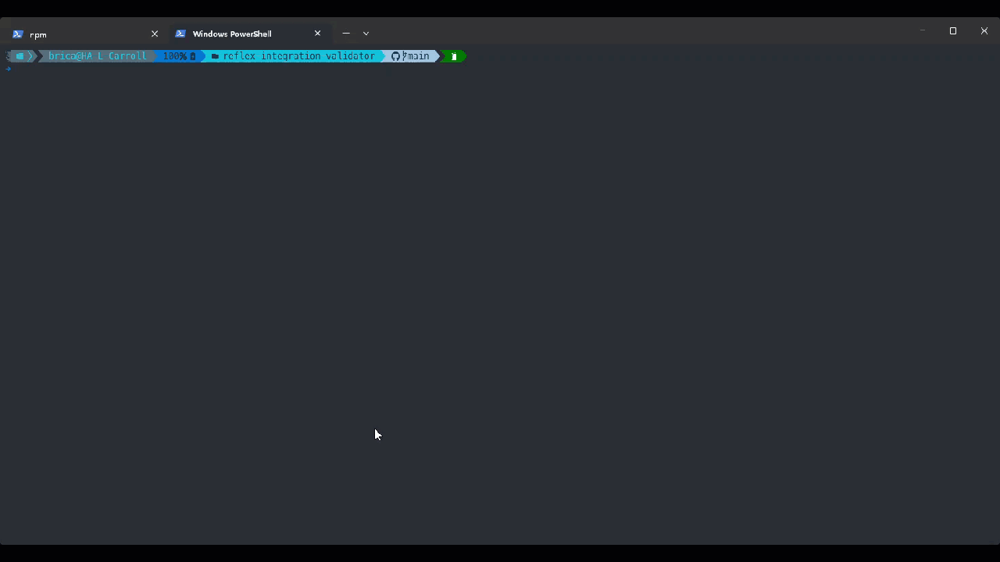

# Reflex Integration Validator

The Reflex Integration Validator is used to validate an Integrations `manifest.json` file against
the standard schema for Integrations

## Usage

```
git clone https://github.com/reflexsoar/reflex-integration-validator
cd reflex-integration-validator
poetry init
# Create your manifest.json file and add it to the "manifests" folder
poetry run reflex-integration-validator
```

## Command Line Arguments

```shell
➜  poetry run reflex-integration-validator --help
usage: reflex-integration-validator [-h] [--manifest MANIFEST] [--manifest-dir MANIFEST_DIR] [--recursive] [--stop-on-failure]

Checks a manifest against the Integration schema

options:
  -h, --help            show this help message and exit
  --manifest MANIFEST   The manifest file to load
  --manifest-dir MANIFEST_DIR
                        The directory to load the manifest from
  --recursive           Recursively load manifests from the manifest directory
  --stop-on-failure     Stop on the first failure
```

## Demonstration

